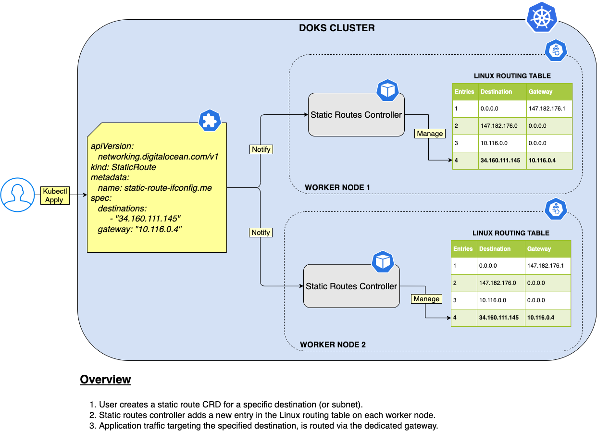

# Overview

The main purpose of the Static Routes Operator is to manage entries in the Linux routing table of each worker node based on CRD spec. It is deployed as a `DaemonSet`, hence it will run on each node of your DOKS cluster.

Below diagram illustrates the operational concept:



## Table of Contents

- [Prerequisites](#prerequisites)
- [Deploying the Kubernetes Static Routes Operator](#deploying-the-kubernetes-static-routes-operator)
- [Testing the Setup](#testing-the-setup)
- [Cleaning Up](#cleaning-up)

## Prerequisites

1. A working DOKS cluster you have access to.
2. Kubectl CLI installed on your local machine, and configured to point to your DOKS cluster.
3. NAT GW Droplet configured and running as detailed [here](https://docs.digitalocean.com/products/networking/vpc/how-to/configure-droplet-as-gateway/).

**Note**:

**Make sure your NAT GW Droplet is created in the same VPC as your DOKS cluster.**

## Deploying the Kubernetes Static Routes Operator

1. Deploy the latest release of static routes operator to your DOKS cluster using kubectl:

    ```shell
    kubectl apply -f deploy https://raw.githubusercontent.com/digitalocean/k8s-staticroute-operator/main/releases/v1/k8s-staticroute-operator-v1.0.0.yaml
    ```

    **Hint:**

    You can check the latest version in the [releases](releases/) path from the [k8s-staticroute-operator](https://github.com/digitalocean/k8s-staticroute-operator/) GitHub repo.

2. Check if operator Pods are up and running:

    ```shell
    kubectl get pods -l name=k8s-staticroute-operator -n static-routes
    ```

    Output looks similar to:

    ```text
    NAME                             READY   STATUS    RESTARTS   AGE
    k8s-staticroute-operator-9vp7g   1/1     Running   0          22m
    k8s-staticroute-operator-mlfff   1/1     Running   0          22m
    ```

3. Check operator logs - no exceptions should be reported:

    ```shell
    kubectl logs -f ds/k8s-staticroute-operator -n static-routes
    ```

    Output looks similar to:

    ```text
    [2022-08-24 14:42:13,625] kopf._core.reactor.r [DEBUG   ] Starting Kopf 1.35.6.
    [2022-08-24 14:42:13,625] kopf._core.engines.a [INFO    ] Initial authentication has been initiated.
    [2022-08-24 14:42:13,626] kopf.activities.auth [DEBUG   ] Activity 'login_via_pykube' is invoked.
    [2022-08-24 14:42:13,628] kopf.activities.auth [DEBUG   ] Pykube is configured in cluster with service account.
    [2022-08-24 14:42:13,629] kopf.activities.auth [INFO    ] Activity 'login_via_pykube' succeeded.
    [2022-08-24 14:42:13,629] kopf.activities.auth [DEBUG   ] Activity 'login_via_client' is invoked.
    [2022-08-24 14:42:13,631] kopf.activities.auth [DEBUG   ] Client is configured in cluster with service account.
    [2022-08-24 14:42:13,632] kopf.activities.auth [INFO    ] Activity 'login_via_client' succeeded.
    [2022-08-24 14:42:13,632] kopf._core.engines.a [INFO    ] Initial authentication has finished.
    [2022-08-24 14:42:13,789] kopf._cogs.clients.w [DEBUG   ] Starting the watch-stream for customresourcedefinitions.v1.apiextensions.k8s.io cluster-wide.
    [2022-08-24 14:42:13,791] kopf._cogs.clients.w [DEBUG   ] Starting the watch-stream for staticroutes.v1.networking.digitalocean.com cluster-wide.
    ...
    ```

## Testing the Setup

Each sample CRD provided creates a static route to two different websites which report back your public IP - [ifconfig.me/ip](http://ifconfig.me/ip), and [ipinfo.io/ip](http://ipinfo.io/ip).

Typical static route definition looks like below:

```yaml
apiVersion: networking.digitalocean.com/v1
kind: StaticRoute
metadata:
  name: static-route-ifconfig.me
spec:
  destinations: 
    - "34.160.111.145"
  gateway: "10.116.0.5"
```

Explanations for the above configuration:

- `spec.destinations` - A list of host IPs (or subnet CIDRs) to route through the gateway.
- `spec.gateway` - Gateway IP address used for routing the host(s)/subnet(s).

To test the setup, download a sample manifest from the [examples](examples) location:

```shell
# Example for ifconfig.me
curl -O https://raw.githubusercontent.com/digitalocean/k8s-staticroute-operator/main/examples/static-route-ifconfig.me.yaml

# Example for ipinfo.io
curl -O https://raw.githubusercontent.com/digitalocean/k8s-staticroute-operator/main/examples/static-route-ipinfo.io.yaml
```

After downloading the manifests, make sure to replace the `<>` placeholders in each manifest file. Then, apply each manifest using kubectl:

```shell
# Example for ifconfig.me
kubectl apply -f static-route-ifconfig.me.yaml

# Example for ipinfo.io
kubectl apply -f static-route-ipinfo.io.yaml
```

**Hint:**

Above command will create the static route custom resources in the default namespace. In production environments (and not only), it's best to have a dedicated namespace with RBAC set (based on what people or teams need to have access).

Next, check if the static route resources were created:

```shell
kubectl get staticroutes
```

The output looks similar to:

```text
NAME                       DESTINATIONS         GATEWAY      AGE
static-route-ifconfig.me   ["34.160.111.145"]   10.116.0.5   7m2s
static-route-ipinfo.io     ["34.117.59.81"]     10.116.0.5   4s
```

Now, check if the custom static routes were applied on each worker node, after SSH-ing:

```shell
route -n
```

The output looks similar to (the irrelevant lines were omitted from the output for better visibility):

```text
Kernel IP routing table
Destination     Gateway         Genmask         Flags Metric Ref    Use Iface
0.0.0.0         206.81.0.1      0.0.0.0         UG    0      0        0 eth0
...
34.117.59.81    10.116.0.5      255.255.255.255 UGH   0      0        0 eth1
34.160.111.145  10.116.0.5      255.255.255.255 UGH   0      0        0 eth1
...
```

**Note:**

In the above example the NAT GW private IP used for testing is `10.116.0.5`.

Next, deploy the [curl-test](examples/curl-test.yaml) Pod to test the setup:

```shell
kubectl apply -f https://raw.githubusercontent.com/digitalocean/k8s-staticroute-operator/main/examples/curl-test.yaml
```

Finally, test if the curl-test pod replies back your NAT GW public IP for each route:

```shell
# Test ifconfig.me/ip endpoint
kubectl exec -it curl-test -- curl ifconfig.me/ip
```

```shell
# Test the ipinfo.io/ip endpoint
kubectl exec -it curl-test -- curl ipinfo.io/ip
```

## Cleaning Up

To clean up the operator and associated resources, please run the following kubectl command (make sure you're using the same release version as in the install step):

```shell
kubectl delete -f deploy https://raw.githubusercontent.com/digitalocean/k8s-staticroute-operator/main/releases/v1/k8s-staticroute-operator-v1.0.0.yaml
```

**Note:**
Above command will delete the associated namespace as well (`static-routes`). Make sure to backup your CRDs first, if needed later.

The output looks similar to:

```text
customresourcedefinition.apiextensions.k8s.io "staticroutes.networking.digitalocean.com" deleted
serviceaccount "k8s-staticroute-operator" deleted
clusterrole.rbac.authorization.k8s.io "k8s-staticroute-operator" deleted
clusterrolebinding.rbac.authorization.k8s.io "k8s-staticroute-operator" deleted
daemonset.apps "k8s-staticroute-operator" deleted
```

Check the routes on each worker node, after SSH-ing:

```shell
route -n
```

The custom static routes should not be present in the routing table output.

Finally, the `curl-test` pod should report back the public IP of the worker node where it runs:

```shell
# Inspect the node where the curl-test Pod runs:
kubectl get pod curl-test -o wide
```

The output looks similar to (write down the node name from the `NODE` column):

```shell
NAME        READY   STATUS    RESTARTS      AGE    IP             NODE            NOMINATED NODE   READINESS GATES
curl-test   1/1     Running   2 (45m ago)   165m   10.244.0.140   basicnp-7micg   <none>           <none>
```

Above example reports - `basicnp-7micg`.

Check the worker node public IP:

```shell
kubectl get nodes -o wide
```

The output looks similar to (note the public IP of the associated node where the `curl-test` Pod runs):

```text
NAME            STATUS   ROLES    AGE     VERSION   INTERNAL-IP   EXTERNAL-IP      OS-IMAGE                       KERNEL-VERSION          CONTAINER-RUNTIME
basicnp-7micg   Ready    <none>   3h20m   v1.23.9   10.116.0.2    206.189.231.90   Debian GNU/Linux 10 (buster)   5.10.0-0.bpo.15-amd64   containerd://1.4.13
basicnp-7micw   Ready    <none>   3h20m   v1.23.9   10.116.0.3    206.81.2.154     Debian GNU/Linux 10 (buster)   5.10.0-0.bpo.15-amd64   containerd://1.4.13
```

Above example reports - `206.189.231.9`.

Exec the `ifconfig.me/ip` curl:

```shell
kubectl exec -it curl-test -- curl ifconfig.me/ip
```

The output looks similar to:

```text
206.189.231.9
```
